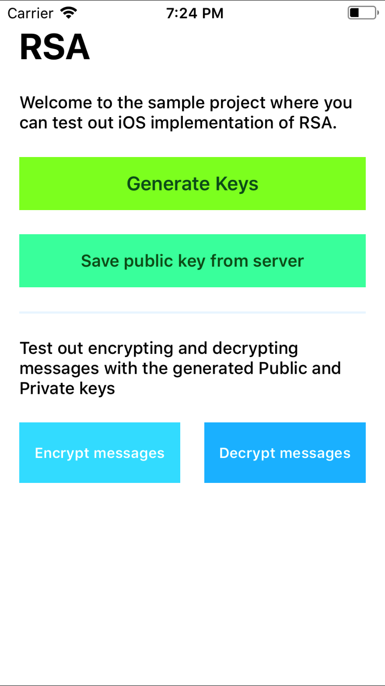
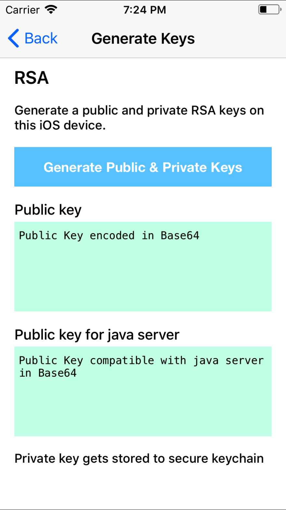
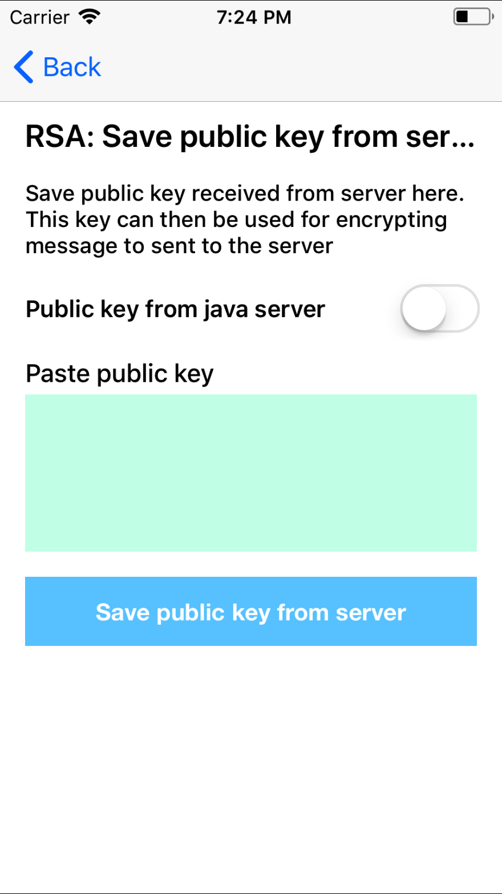
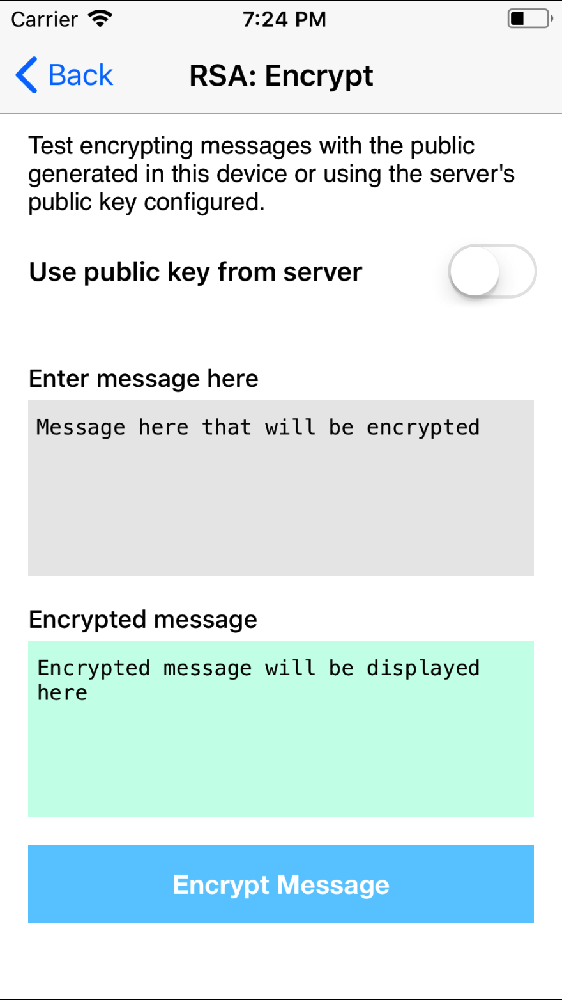
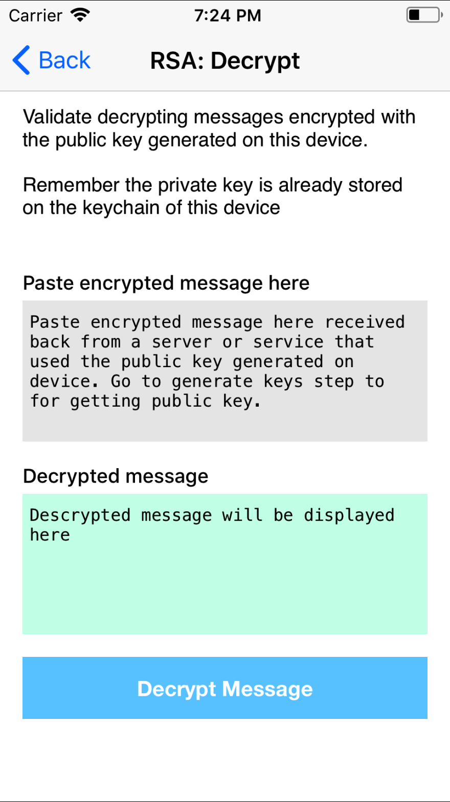

# RSA in iOS
### RSA wrapper in ObjectiveC and Quick sample project to test

---

Internet had very little to offer for RSA on iOS (at the time of first commit). Over complicated code, no documentation or required using 3rd Party Frameworks. 

This can be done natively on iOS using the `Security` framework. So to save future readers some time, this project was put together.

<p align="center">
  
  
  
  
  
</p>


### RSA.h

```
// Start a instance using +(void)sharedInstance

// Then call this method with 3 unique string as indentifiers
// Identifier in simple words is just names to used to remember these keys in a keychain

- (void)setIdentifierForPublicKey:(NSString *)pubIdentifier
                       privateKey:(NSString *)privIdentifier
                  serverPublicKey:(NSString *)servPublicIdentifier;
```


```
// Call this to generate the a pair of public and private keys for the mobile
- (void)generateRSAKeyPair:(RSACompletionBlock)completion;
```

##### Helper Methods
```
// Set the key size of RSA.
// enum RSAKeySize
//    k512 = 512
//    k768 = 768
//    k1024 = 1024
//    k2048 = 2048

- (void)setRSAKeySize:(RSAKeySize)keySize;


// Use this to remove the PEM encoding
- (NSString *)stripPEM:(NSString *)keyString;

```

##### Encryption Methods
```
- (NSString *)encryptUsingPublicKeyWithData:(NSData *)data;
- (NSString *)encryptUsingPrivateKeyWithData:(NSData*)data;
```

##### Decryption Methods
```
- (NSString *)decryptUsingPublicKeyWithData:(NSData *)data;
- (NSString *)decryptUsingPrivateKeyWithData:(NSData*)data;
```

##### SET and GET Public Key
```
- (BOOL)setPublicKey:(NSString *)keyAsBase64;
- (NSString *)getPublicKeyAsBase64;
```

##### Encrypt using Server's Public Key
```
// Use setPublicKey before using this method to set the server public key
- (NSString *)encryptUsingServerPublicKeyWithData:(NSData *)data;
```

---


### Have a Java Backened ?
##### It might require OID padding in the keys encoding to get it interfacing with iOS.

Great many thanks to Berin for [his blog post](http://blog.wingsofhermes.org/?p=75) on getting this working. 

##### Accessors for public key from java servers with OID in keys
```
- (BOOL)setPublicKeyFromJavaServer:(NSString *)keyAsBase64;
- (NSString *)getPublicKeyAsBase64ForJavaServer;
```


## License
The MIT License (MIT)

Copyright (c) 2012 Reejo Samuel (http://reejosamuel.com/)


Permission is hereby granted, free of charge, to any person obtaining a copy
of this software and associated documentation files (the “Software”), to deal
in the Software without restriction, including without limitation the rights
to use, copy, modify, merge, publish, distribute, sublicense, and/or sell
copies of the Software, and to permit persons to whom the Software is
furnished to do so, subject to the following conditions:

The above copyright notice and this permission notice shall be included in
all copies or substantial portions of the Software.

THE SOFTWARE IS PROVIDED “AS IS”, WITHOUT WARRANTY OF ANY KIND, EXPRESS OR
IMPLIED, INCLUDING BUT NOT LIMITED TO THE WARRANTIES OF MERCHANTABILITY,
FITNESS FOR A PARTICULAR PURPOSE AND NONINFRINGEMENT. IN NO EVENT SHALL THE
AUTHORS OR COPYRIGHT HOLDERS BE LIABLE FOR ANY CLAIM, DAMAGES OR OTHER
LIABILITY, WHETHER IN AN ACTION OF CONTRACT, TORT OR OTHERWISE, ARISING FROM,
OUT OF OR IN CONNECTION WITH THE SOFTWARE OR THE USE OR OTHER DEALINGS IN
THE SOFTWARE.